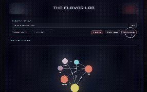
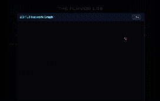
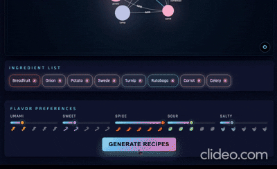

# 🧪 The Flavor Lab 👩‍🍳

## 🎯 What is The Flavor Lab?

Tired of the same old recipes? The Flavor Lab is your culinary cheat code!

This groundbreaking, interactive application unlocks the hidden chemistry behind taste. Forget traditional pairing guides – we use the science of the FlavorGraph network to map common aromatic compounds, letting you input any ingredient and instantly receive shocking, yet scientifically perfect, flavor matches.

It's the essential tool for chefs, mixologists, and ambitious home cooks who want to break boundaries, create signature dishes, and achieve culinary genius: all rooted in pure, delicious chemistry.

## 🚀 Features
          
- **Interactive Ingredient Network**: Search and explore ingredients in a beautiful 2D network graph
- **3D Flavor Graph**: Visualize ingredient relationships in immersive 3D space
- **Scientifically-Backed Pairings**: Get flavor matches based on shared aromatic compounds and co-occurance
- **AI Recipe Generation**: Generate custom recipes using your selected ingredients
- **Flavor Preferences**: Adjust umami, salty, sweet, sour, and bitter sliders to customize recipes
- **Category & Dietary Filters**: Filter ingredients by category and dietary restrictions
- **Ingredient Tracking**: Build your ingredient list and generate recipes

## 🛠️ Tech Stack

### Frontend
- **Vanilla JavaScript** - Core application logic
- **vis-network** - 2D interactive network graph visualization
- **3d-force-graph** - 3D force-directed graph (Three.js based)
- **Three.js** - 3D graphics and rendering
- **UnrealBloomPass** - Post-processing bloom effects for 3D graph
- **Font Awesome** - Icons

### Backend
- **Python 3**
- **Pandas** - Data manipulation and analysis
- **NumPy** - Numerical computing
- **Scikit-Learn** - Machine learning algorithms
- **Sentence-transformers** - Semantic similarity for ingredient matching
- **PyTorch** - Deep learning framework (dependency of sentence-transformers)
- **NetworkX** - Graph analysis and manipulation
- **Matplotlib** - Data visualization
- **Seaborn** - Statistical data visualization
- **JupyterLab** - Interactive development environment

### APIs
- **OpenAI** - AI-powered recipe generation
- **Pexels** - Food photography and images

### Deployment
- **Netlify** - Frontend hosting
- **Python HTTP Server** - Local development server

### Data
- **JSON** - Network data (`network_data_hub.json`, `ingr_ingr_hub.json`)
- **CSV** - Ingredient similarity scores and relationships

## 📊 Data Source

**FlavorGraph**: https://github.com/lamypark/FlavorGraph

- Food + chemical compound network
- Build relationships between ingredients
- Visualize as a graph
- Scientific backing for flavor pairings

**Scientific Paper on FlavorGraph Dataset**: https://www.nature.com/articles/s41598-020-79422-8

## 🎨 Project Philosophy

- **Scientific** - Rooted in real chemistry
- **Logical** - Makes sense to users
- **Amazing** - Surprising flavor combinations
- **Practical** - Actually useful in the kitchen

## 🧪 How It Works

1. **Input**: Enter any ingredient (e.g., "strawberry", "basil", "chocolate")
2. **Analysis**: Our system analyzes chemical compounds using FlavorGraph data
3. **Matching**: Find ingredients with shared aromatic compounds
4. **Visualization**: Explore relationships in interactive 2D or 3D graphs
5. **Output**: Get surprising yet scientifically perfect pairings
6. **Recipes**: Generate AI-powered recipe suggestions based on your selections

## 🎯 Use Cases

- **Chefs**: Discover unexpected ingredient combinations for signature dishes
- **Mixologists**: Find perfect cocktail pairings
- **Home Cooks**: Break out of recipe ruts with science-backed suggestions
- **Food Enthusiasts**: Understand the chemistry behind great flavors

## 🚀 Getting Started

### Prerequisites
- Python 3.x
- Node.js (for package management, optional)

## 🌐 Live Demo

**Webapp**: https://theflavorlab.netlify.app/

## 🙏 Acknowledgments

- **FlavorGraph** by lamypark for the incredible food chemistry dataset
- The scientific community for flavor compound research
- All the chefs and food scientists who make this possible

Ready to revolutionize your cooking? Start experimenting with flavors! 🧪👨‍🍳
